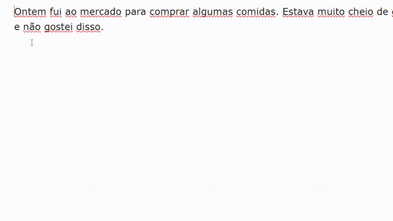

# AndesAI 🏔️✨

**AndesAI** é uma extensão para Google Chrome que utiliza o poder de um modelo de linguagem rodando localmente para aprimorar, corrigir e "polir" textos diretamente em campos editáveis na web.

-----

### Demonstração



-----

## 📖 Sobre o Projeto

Este projeto foi desenvolvido como uma aplicação full-stack para demonstrar a integração entre um frontend (extensão de navegador) e um backend de IA. A principal motivação foi criar uma ferramenta de assistência de escrita que respeita a privacidade do usuário, processando todos os dados localmente, sem enviar informações para servidores externos.

A extensão detecta de forma inteligente quando um usuário está em um campo de texto (`<textarea>` ou `contenteditable`), e, ao selecionar um trecho, apresenta uma UI flutuante para acionar a melhoria. O resultado é então apresentado em um modal com opções para substituir o texto original ou copiar o resultado.

-----

## ✨ Funcionalidades Principais

  * **IA Local:** Utiliza o modelo Llama 3.1 rodando via Ollama, garantindo que nenhum texto do usuário saia da sua máquina.
  * **UI Contextual:** O botão "Improve" só aparece em campos de texto editáveis, evitando poluir a interface em sites normais.
  * **Feedback Visual:** A interface informa ao usuário quando a IA está processando o texto através de um ícone de carregamento (spinner).
  * **Modal de Resultados:** Exibe o texto original e o melhorado em um modal limpo e moderno.
  * **Ações Rápidas:** Botões para **Substituir** o texto original na página ou **Copiar** o texto aprimorado para a área de transferência.
  * **Manipulação Inteligente do DOM:** A função de "Substituir" trata `<textarea>` e `contenteditable` de formas diferentes para garantir a integridade da página.

-----

## 🛠️ Tecnologias Utilizadas

  * **Backend:** Python, Flask, Flask-CORS
  * **Inteligência Artificial:** Llama 3.1 8B, Ollama
  * **Frontend:** JavaScript (Vanilla JS), HTML5, CSS3
  * **Ambiente:** Extensão de Navegador (Chrome Manifest V3)

-----

## 📂 Estrutura do Projeto

```
AndesAI/
├── extension/            # Contém os arquivos do frontend (extensão)
│   ├── content.js
│   ├── style.css
│   ├── manifest.json
│   ├── index.html
│   └── images/
│       └── ...
└── server/               # Contém os arquivos do backend (servidor)
    ├── server.py
    ├── requirements.txt
    └── .venv/
```

-----

## 🚀 Como Instalar e Rodar

Siga os passos abaixo para ter o projeto rodando em sua máquina.

### Pré-requisitos

  * **Python 3.8+**: download em [python.com](https://www.python.org/downloads/)
  * **Ollama:** Faça o download em [ollama.com](https://ollama.com/)
  * **Git** (para clonar o repositório) - [download](https://git-scm.com/downloads)

### 1. Backend (Servidor Python)

Primeiro, vamos configurar e iniciar o servidor local.

```bash
# 1. Clone este repositório
git clone https://github.com/seu-usuario/AndesAI.git
cd AndesAI/server

# 2. Crie e ative um ambiente virtual
# No Windows
python -m venv venv
.\venv\Scripts\activate
# No macOS / Linux
python3 -m venv venv
source venv/bin/activate

# 3. Instale as dependências do Python
pip install -r requirements.txt

# 4. Baixe o modelo Llama 3.1 via Ollama (pode demorar um pouco)
ollama run llama3.1:8b

# 5. Inicie o servidor Flask (mantenha este terminal aberto)
python server.py
```

Se tudo deu certo, você verá uma mensagem indicando que o servidor está rodando em `http://127.0.0.1:5000`.

### 2. Frontend (Extensão do Chrome)

Agora, vamos carregar a extensão no seu navegador.

1.  Abra o Google Chrome.
2.  Navegue até `chrome://extensions`.
3.  No canto superior direito, ative o **"Modo de desenvolvedor"** (Developer mode).
4.  Clique no botão **"Carregar sem compactação"** (Load unpacked).
5.  Uma janela para selecionar uma pasta se abrirá. Navegue até a pasta do projeto e selecione a pasta `extension` (`AndesAI/extension`).
6.  Clique em "Selecionar pasta".

A extensão **AndesAI** deverá aparecer na sua lista de extensões, pronta para uso!

-----

## 💡 Como Usar

1.  Com o servidor Python rodando, navegue para qualquer site que tenha uma caixa de texto (como a área de comentários do YouTube, um post no Reddit, etc.).
2.  Digite um texto.
3.  Selecione o texto que você digitou.
4.  O botão "Improve ✨" aparecerá ao lado do seu cursor. Clique nele.
5.  Aguarde o processamento e use os botões "Replace" ou "Copy" no modal que aparecerá.

Com certeza. É uma observação muito importante para quem for testar seu projeto. Adicionar essa nota no `README.md` mostra que você pensou nas diferentes configurações e cenários de uso.

Aqui está uma seção que você pode copiar e colar diretamente no final da seção "Como Usar" ou "Tecnologias Utilizadas" do seu `README.md`.

---

### 💡 Nota sobre Performance e Qualidade

Este projeto foi configurado por padrão para usar o modelo `llama3.1:8b`, que oferece um excelente equilíbrio entre velocidade e qualidade na maioria dos computadores modernos.

Você pode facilmente experimentar outros modelos disponíveis no Ollama para ajustar a experiência ao seu hardware:

* **Para maior qualidade:** Se você possui uma placa de vídeo potente (ex: 16GB+ de VRAM), pode obter respostas mais precisas e sofisticadas usando um modelo maior como o `llama3:70b`. A desvantagem é um tempo de resposta mais lento.
* **Para maior velocidade:** Se a resposta parecer lenta em sua máquina, considere usar um modelo mais leve como o `phi3`. A resposta será quase instantânea, com uma pequena troca na complexidade da sugestão.

Para alterar o modelo, simplesmente edite a linha `"model": "llama3.1:8b"` no arquivo `server/server.py` para o modelo de sua escolha.